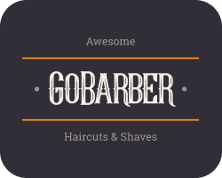

<h1 align="center">
  
</h1>

<h3 align="center">
  Aplicação mobile com React Native para o aplicativo GoBarber
</h3>

<p align="center">
  

  <a href="https://www.linkedin.com/in/guilhermehenrry/">
    
  </a>

  
</p>

# :pushpin: Índice

- [Sobre o projeto](#:information_source-sobre-o-projeto)
- [Tecnologias](#rocket-tecnologias)
- [Como utilizar](#construction_worker-como-utilizar)

# :information_source: Sobre o projeto
Aplicação para agendamentos de serviços para barbearia. Este repositorio contém aplicação completa backend, web e mobile. Para conhecer as funcionalidades e como execultar em outros ambientes [clique aqui](https://github.com/Guihenrry/gobarber).

# :rocket: Tecnologias

Algumas tecnologias e ferramentas utilizadas.

- [React Native](https://reactnative.dev/)
- [TypeScript](https://www.typescriptlang.org/)
- [React Navigation](https://reactnavigation.org/)
- [React Native Vector Icons](https://github.com/oblador/react-native-vector-icons)
- [UnForm](https://unform.dev/)
- [Eslint](https://eslint.org/) + [Prettier](https://prettier.io/) + [EditorConfig](https://editorconfig.org/)


# :construction_worker: Como utilizar

Para testar esta aplicação você precisará utilizar um emulador ou execultar em seu dispositivos fisico. [Tutorial para configurar ambiente react native](https://react-native.rocketseat.dev/)

**OBS:** Para utilizar este projeto será necessário que a API esteja em execução.

```bash
# Instalar dependencias
$ yarn

# Execute o projeto no android
$ react-native run-android

# Execute o projeto no ios
$ react-native run-ios
```

---

Feito com 🧡 by [Gui Henrry](https://www.linkedin.com/in/guilhermehenrry/) ✌
