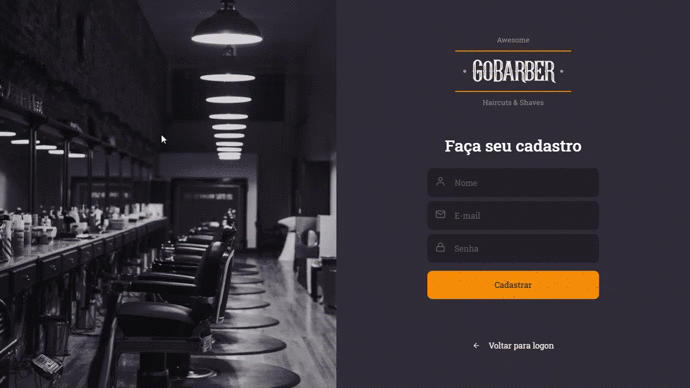

<h1 align="center">
  
</h1>

<h3 align="center">
  Aplicação web com ReactJS para o aplicativo GoBarber
</h3>

<p align="center">
  

  <a href="https://www.linkedin.com/in/guilhermehenrry/">
    
  </a>

  
</p>

<p align="center">
  
</p>

# :pushpin: Índice

- [Sobre o projeto](#information_source-sobre-o-projeto)
- [Tecnologias](#rocket-tecnologias)
- [Como utilizar](#construction_worker-como-utilizar)

# :information_source: Sobre o projeto
Aplicação para agendamentos de serviços para barbearia. Este repositorio contém aplicação completa backend, web e mobile. Para conhecer as funcionalidades e como execultar em outros ambientes [clique aqui](https://github.com/Guihenrry/gobarber).

# :rocket: Tecnologias

Algumas tecnologias e ferramentas utilizadas.

- [ReactJS](https://reactjs.org/)
- [TypeScript](https://www.typescriptlang.org/)
- [React Router DOM](https://reacttraining.com/react-router/)
- [Styled Components](https://styled-components.com/)
- [UnForm](https://unform.dev/)
- [React-Day-Picker](https://react-day-picker.js.org/)
- [Date-fns](https://date-fns.org/)
- [Eslint](https://eslint.org/) + [Prettier](https://prettier.io/) + [EditorConfig](https://editorconfig.org/)


# :construction_worker: Como utilizar

**OBS:** Para utilizar este projeto será necessário que a [API](https://github.com/Guihenrry/gobarber/tree/master/backend) esteja em execução.

```bash
# Instalar as dependencias
$ yarn

# Execute o projeto na porta 3000
$ yarn start
```

---

Feito com 🧡 by [Gui Henrry](https://www.linkedin.com/in/guilhermehenrry/) ✌
